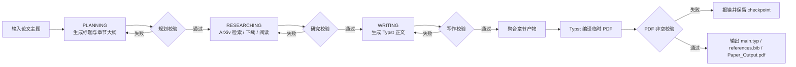

# PaperPilot


一个面向学术写作场景的 AI Agent，用于完成从论文大纲规划、文献检索与笔记整理，到 Typst 正文生成和 PDF 编译的整条自动化流程。

## 目录

- [功能特点](#功能特点)
- [流程总览](#流程总览)
- [项目结构](#项目结构)
- [工作流程](#工作流程)
  - [1. PLANNING（规划阶段）](#1-planning规划阶段)
  - [2. RESEARCHING（研究阶段）](#2-researching研究阶段)
  - [3. WRITING（写作阶段）](#3-writing写作阶段)
  - [4. PDF 编译与收尾](#4-pdf-编译与收尾)
- [会话恢复](#会话恢复)
- [环境要求](#环境要求)
- [快速开始](#快速开始)
  - [1. 安装依赖](#1-安装依赖)
  - [2. 配置环境变量](#2-配置环境变量)
  - [3. 运行项目](#3-运行项目)
- [示例输入](#示例输入)
- [支持的工具](#支持的工具)
- [输出产物](#输出产物)
- [支持的 LLM 提供商](#支持的-llm-提供商)
- [开发说明](#开发说明)
  - [扩展新的 LLM](#扩展新的-llm)
  - [扩展新的工具](#扩展新的工具)
  - [与稳健性相关的关键模块](#与稳健性相关的关键模块)
- [注意事项](#注意事项)
- [许可证](#许可证)

## 功能特点

- **三阶段论文生成**：PLANNING（大纲）→ RESEARCHING（研究）→ WRITING（写作）
- **按阶段输出校验**：分别校验规划 JSON、研究标签结构和写作 Typst 正文，降低掉格式污染后续流程的概率
- **稳健工具调用**：统一 tool call 结构，写作阶段显式禁用工具，避免正文混入控制信息
- **会话快照与恢复**：自动保存成功/失败 checkpoint，支持启动时列出最近可恢复会话并继续运行
- **Fail-safe PDF 编译**：先编译到临时 PDF，校验非空后再替换正式产物，避免空 PDF 被误判为成功
- **真实文献研究链路**：支持 ArXiv 搜索、PDF 下载和全文读取，研究阶段保留 `<notes>` 与 `<references>` 结构
- **多 LLM 提供商**：支持 Ollama、OpenAI 兼容接口、智谱 AI
- **流式终端体验**：实时显示思考、正文输出、工具调用与阶段进度

## 流程总览



这个流程的核心目标是把长链路拆成可验证、可恢复、可重试的阶段，尽量减少格式污染和单点失败对最终产物的影响。

## 项目结构

```text
paperpilot/
├── src/
│   ├── config/          # 配置与 Prompt 模板
│   ├── core/            # AgentEngine、LLM 抽象
│   ├── llms/            # Ollama / OpenAI / Zhipu 适配层
│   ├── models/          # Message、PaperContext 等数据模型
│   ├── tools/           # ArXiv、PDF、文件读写、等待工具
│   └── utils/           # 校验器、日志、JSON 提取、会话存储
├── data/
│   ├── arxiv_download/  # 下载的论文 PDF
│   └── sessions/        # 会话快照与 checkpoint
├── outputs/             # 生成的 Typst 草稿、BibTeX、PDF
├── logs/                # 运行日志
├── main.py              # CLI 入口
└── pyproject.toml
```

## 工作流程

### 1. PLANNING（规划阶段）

- 根据论文主题生成标题和章节大纲
- 要求模型只返回合法 JSON object
- 自动校验 `title`、`sections` 结构，发现代码块、控制信息或非法 JSON 时自动重试

### 2. RESEARCHING（研究阶段）

- 按章节调用 ArXiv 检索、下载 PDF、读取全文
- 模型必须输出 `<notes>...</notes>` 与 `<references>...</references>`
- 自动验证研究笔记非空、参考文献非空，并确保至少提取出一条有效 BibTeX

### 3. WRITING（写作阶段）

- 基于研究笔记生成 Typst 正文草稿
- 写作阶段显式禁用工具调用，避免正文夹带 tool call 残片
- 写入 `.typ` 前校验正文长度、非法标签、JSON 残留、Provider 报错文本等异常内容

### 4. PDF 编译与收尾

- 聚合章节草稿生成 `main.typ` 与 `references.bib`
- 使用 Typst 编译到临时文件，再替换正式 `Paper_Output.pdf`
- 若编译失败或输出文件为空，流程直接报错，不会误报完成

## 会话恢复

PaperPilot 会在关键节点自动写入 checkpoint，便于失败后继续：

- 每次 LLM 输出通过阶段校验后保存成功快照
- 每次阶段失败或校验失败时记录错误快照
- 每个章节写作完成、PDF 编译成功后更新会话状态
- 启动时自动列出最近 5 个可恢复会话，可输入序号继续，也可直接回车创建新会话

会话目录结构示例：

```text
data/sessions/<session_id>/session.json
data/sessions/<session_id>/turns/0001_success_planning.json
data/sessions/<session_id>/turns/0002_error_research_01_attempt_1.json
data/sessions/<session_id>/artifacts/
```

## 环境要求

- Python 3.13+
- `uv`
- Typst Python 库（已在依赖中）
- 若使用 Ollama，需要本地启动对应模型服务

如果你本机还没有安装 `uv`，可以先执行：

```bash
pipx install uv
```

也可以参考官方安装说明：<https://docs.astral.sh/uv/getting-started/installation/>

## 快速开始

### 1. 安装依赖

```bash
uv sync
```

### 2. 配置环境变量

在项目根目录创建 `.env` 文件。

#### Ollama

```bash
LLM_PROVIDER=ollama
LLM_MODEL=qwen3:8b
LLM_BASE_URL=http://localhost:11434
```

不推荐使用小于等于 8B 的模型处理完整论文链路，容易在结构化输出和长流程一致性上出错（qwen3.5:9b 疑似本地执行效果还可以，但是由于配置问题，输出过慢，没有完整跑通流程）。

#### 智谱 AI（Zhipu）

```bash
LLM_PROVIDER=zhipu
LLM_BASE_URL=https://open.bigmodel.cn/api/paas/v4/
LLM_API_KEY=your_api_key_here
LLM_MODEL=glm-4.7-flash
```

#### OpenAI 兼容接口

```bash
LLM_PROVIDER=openai
LLM_BASE_URL=https://api.openai.com/v1/
LLM_API_KEY=your_api_key_here
LLM_MODEL=gpt-4
```

#### 可选配置

```bash
# 日志级别
LOG_LEVEL=INFO

# 单次阶段内的最大对话轮数
MAX_TURNS=30

# 单个阶段输出校验失败后的最大重试次数
LLM_RETRY_MAX_ATTEMPTS=5

# 输出语言，会注入 Prompt
OUTPUT_LANGUAGE=中文

# LLM 温度
LLM_TEMP=0.7

# 是否启用思考模式
LLM_THINK=true

# 速率限制重试退避参数
LLM_RETRY_BASE_DELAY=1.0
LLM_RETRY_MAX_DELAY=16.0
```

### 3. 运行项目

```bash
uv run python main.py
```

启动后你可以：

- 直接输入新论文主题，开始新会话
- 输入最近可恢复会话前面的序号，继续未完成任务
- 直接输入某个 `session_id`，恢复指定会话

## 示例输入

启动后，你可以直接输入类似下面的论文主题，让 Agent 自动进入规划阶段：

```text
探讨联邦学习中的混合知识蒸馏技术及其在数据隐私保护中的应用
```

如果希望更稳定地产出结构化结果，建议在题目中明确研究对象、方法范围和应用场景。

## 支持的工具

| 工具名 | 功能说明 |
|--------|----------|
| `arxiv_search` | 在 ArXiv 搜索学术论文 |
| `arxiv_download` | 下载 ArXiv 论文 PDF |
| `pdf_read` | 读取 PDF 文件内容 |
| `file_read` | 读取文本文件 |
| `file_write` | 写入文本文件 |
| `time_sleep` | 等待指定时间 |

## 输出产物

生成结果默认位于 `outputs/`，单次任务通常包含：

- `main.typ`：主 Typst 文件
- `references.bib`：研究阶段收集的 BibTeX 文献
- `Paper_Output.pdf`：最终论文 PDF
- `NN_section_name.typ`：各章节的 Typst 草稿

运行状态与恢复信息保存在 `data/sessions/`，下载的论文 PDF 保存在 `data/arxiv_download/`。

## 支持的 LLM 提供商

| 提供商 | 说明 | 特点 |
|--------|------|------|
| Ollama | 本地部署 | 无需外网，适合本地实验 |
| OpenAI | OpenAI 兼容 API | 兼容面广，接入方便 |
| Zhipu | 智谱 AI | 中文任务表现友好，国内可用 |

**注：** 智谱的 `glm-4.7-flash` 出现了未知问题，会把工具调用的特殊 token 返回，即使使用了智谱官方 SDK 也会出现同样的问题，很可能默认的五次重试都肘不赢，可以考虑替换其他模型

## 开发说明

### 扩展新的 LLM

1. 在 `src/llms/` 下实现新的适配类并继承 `LLMInterface`
2. 实现 `response_stream()`，输出统一的文本块或 `tool_call_request` 事件
3. 在 `src/llms/llm_factory.py` 中注册新 provider

### 扩展新的工具

1. 在 `src/tools/` 下创建工具类并继承 `BaseTool`
2. 为工具提供 `to_func_call()` 所需的参数描述
3. 在 `src/tools/register.py` 的 `all_tools` 中注册

### 与稳健性相关的关键模块

- `src/utils/validation.py`：规划/研究/写作三个阶段的输出校验器
- `src/utils/session_store.py`：会话快照、checkpoint 存储与恢复
- `src/core/llm_interface.py`：工具参数解析、tool call 归一化、Provider 调用重试
- `src/core/agnet.py`：阶段状态机、校验重试、PDF 编译与输出落盘

## 注意事项

1. 本项目用于辅助学术写作、文献整理和结构化生成，不提供任何“降重”能力。
2. 生成内容仅供参考，请自行核验事实、引用与学术规范。
3. ArXiv 下载与 PDF 读取受网络环境影响，必要时请自行配置代理。
4. 如果模型能力不足，最常见的问题是大纲掉格式、BibTeX 不完整或 Typst 正文不稳定，建议优先更换更强模型。

## 许可证

MIT License
